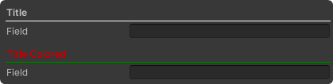
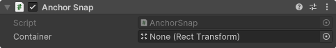
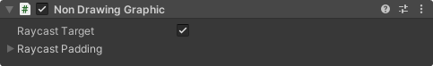

# Ni-Essentials
Ni-Essentials is a foundational module that provides a collection of basic utilities and functions commonly used across various projects. It serves as a generic toolkit to streamline development and maintain consistency across different modules and applications.

> ⚠️ Documentation is incomplete. For detailed information, please refer to the code and XML comments.

## Requirements
* Unity 2022.2 or later
* Text Mesh Pro 3.0.6 or later

## Installation

### Manual
1. Clone this repository or download the source files.
2. Copy the `Ni-Essentials` folder into your Unity project's `Assets` directory.

### UPM
1. Open Package Manager from Window > Package Manager.
2. Click the "+" button > Add package from git URL.
3. Enter the following URL:

```
https://github.com/HoSHIZA/Ni-Essentials.git
```

### Manual with `manifest.json`
1. Open `manifest.json`.
2. Add the following line to the file:

```
"com.ni-games.essentials" : "https://github.com/HoSHIZA/Ni-Essentials.git"
```

## Attributes
<details>
<summary><b>[ReadOnly]</b>: Makes fields read-only in the inspector.</summary>


```csharp
[ReadOnly] public int a;
```
---
</details>

<details>
<summary><b>[Title]</b>: Adds a title with a separator line.</summary>



```csharp
[Title("Header Text", LabelColor = "red", LineColor = "green")]
public string a;
```
---
</details>

<details>
<summary><b>[Reference]</b>: Displays a field for selecting managed references.</summary>

Displays a field for selecting a managed reference in the inspector. When used, you must mark the desired classes with the `[System.Serializable]` attribute.

Works only when paired with `[SerializeReference]`.


```csharp
public interface IManagedObject {}
public interface ISomeManagedObject {}

[Serializable]
public class A : IManagedObject {}

[Category("Category")] // Specifies the category in the selection menu.
[DisplayName("New Name")] // Renames the class in the selection menu.
[Serializable]
public class B : IManagedObject {}

[Category("")] // Removes from all categories, including the inheritance tree.
[Serializable]
public class C : IManagedObject {}

[Serializable]
public class D : ISomeManagedObject {}

[Reference]
public IManagedObject ManagedReferenceField;

// Shows only objects inherited from `ISomeManagedObject` for selection.
[Reference(typeof(ISomeManagedObject))]
public IManagedObject ManagedReferenceField;
```
---
</details>

<details>
<summary><b>[ScenePicker]</b>: Creates a dropdown for selecting scenes.</summary>

Applies only to a field of type `string` and returns the name of the scene.


```csharp
[ScenePicker] public string SceneName;
```
---
</details>

<details>
<summary><b>[TypePicker]</b>: Creates a dropdown for selecting Types.</summary>

Applies only to a field of type string and returns AssemblyQualified type name.

```csharp
[TypePicker] public string TypeName;
```
---
</details>

<details>
<summary><b>[ObjectPicker]</b>: Creates a dropdown for selecting UnityEngine.Objects.</summary>

> ⚠️ May break inspector

```csharp
[ObjectPicker] public Object UnityObject;
```
</details>

## Components

### MonoBehaviour
* <b>Destroyer</b>: Destroys the object when it is created.
* <b>Disabler</b>: Disables the object when it is created.
* <b>DontDestroyOnLoad</b>: Marks the object for DontDestroyOnLoad.

### UI
<details>
<summary><b>AnchorSnap</b>: Dynamic anchoring.</summary>



</details>

<details>
<summary><b>NonDrawingGraphic</b>: MaskableGraphic designed for raycast.</summary>



</details>

<details>
<summary><b>DraggableRect</b>: Draggable Rect.</summary>
</details>

## Collections
<details>
<summary><b>FastList</b>: High-performance, minimal array-based list.</summary>

```csharp
FastList<string> list = new FastList<string>(32);
```
</details>

## Helpers
<details>
<summary><b>PlayerLoopHelper</b>: Modify Unity PlayerLoop and access callbacks.</summary>

It allows you to add your own runners, and also provides access to PlayerLoop callbacks for each timing via static `Action`.

```csharp
using NiGames.Essentianls.Helpers;

public struct CustomUpdate { } // Update
public struct CustomFixedUpdate { } // FixedUpdate

// Method to modify PlayerLoop, use it to modify PlayerLoop conveniently.
// Automatically applies PlayerLoop changes when the method completes.
PlayerLoopHelper.ModifyLoop(systems =>
{
    // Inserts a custom runner into the Loop of the specified timing.
    systems.InsertLoop<Update, CustomUpdate>(static () => { /* Action */ });
    
    // Inserts a custom runner into the Loop of the specified timing.
    systems.InsertLoop<FixedUpdate, CustomFixedUpdate>(static () => { /* Action */ });
    
    // Attempt to remove the runner.
    systems.TryRemoveLoop<FixedUpdate, CustomFixedUpdate>();
});
```

It is also possible to subscribe to events from PlayerLoop.

```csharp
PlayerLoopHelper.OnFixedUpdate += static () => { /* Action */ };
```

or...

```csharp
PlayerLoopHelper.Subscribe(PlayerLoopTiming.EarlyUpdate, static () => { /* Action */ });
```
---
</details>

<details>
<summary><b>ScreenHelper</b>: Track screen resolution and orientation changes.</summary>

```csharp
using NiGames.Essentianls.Helpers;

var isLandscape = ScreenHelper.IsLandscape;
var isPortrait = ScreenHelper.IsPortrait;

ScreenHelper.ResolutionChanged += newResolution => { /* Action */ };
ScreenHelper.OrientationChanged += newOrientation => { /* Action */ };

ScreenHelper.SetPollingTime(2f); // Sets the polling time (in seconds). If 0, each frame is polled.
```
---
</details>

<details>
<summary><b>InitHelper</b>: Safe initialization with disabled domain reloading.</summary>

```csharp
using NiGames.Essentianls.Helpers;

var isLandscape = ScreenHelper.IsLandscape;
var isPortrait = ScreenHelper.IsPortrait;

ScreenHelper.ResolutionChanged += newResolution => { /* Action */ };
ScreenHelper.OrientationChanged += newOrientation => { /* Action */ };

ScreenHelper.SetPollingTime(2f); // Sets the polling time (in seconds). If 0, each frame is polled.
```
</details>

## Features

### Easing

<details>
<summary><b>Easing</b>: Built-in easing functions and utility class.</summary>

```csharp
using NiPrefs.Essentianls.Easing;

float t = 0.5f;
float easedT = EaseUtility.Evaluate(t, Ease.InCubic); 
float easedT = EaseUtility.Evaluate(t, Ease.InOutBounce);

Func<float, float> easeFunc = EaseFunction.Linear;
```
---
</details>

### UI

<details>
<summary><b>UI Blocker</b>: Create UI blockers to prevent event propagation.</summary>

```csharp
// TODO
```
---
</details>

### Pooling

<details>
<summary><b>AbstractPooledBuffer</b>: Used to implement the Builder pattern.</summary>

Example Buffer implementation:
```csharp
public class SomeBuilderBuffer : AbstractPooledBuffer<SomeBuilderBuffer> 
{
    public bool Parameter1;
    public string Parameter2;
    
    protected override void Reset()
    {
        Parameter1 = false;
        Parameter2 = "default";
    }
}
```

Example Builder implementation:
```csharp
public struct SomeBuilder
{
    internal ushort Revision;
    internal SomeBuilderBuffer Buffer;
    
    internal SomeBuilder(SomeBuilderBuffer buffer)
    {
        Revision = buffer.Revision;
        Buffer = buffer;
    }

    public readonly SomeBuilder WithParameter1(bool value)
    {
        Buffer.Parameter1 = value;
        return this;
    }

    public readonly SomeBuilder WithParameter2(string value)
    {
        Buffer.Parameter2 = value;
        return this;
    }
    
    public SomeObject Build() 
    {
        var result = new SomeObject(Buffer.Parameter1, Buffer.Parameter2);
        
        Buffer.Dispose();
        
        return result;
    }
}
```

Usage:
```csharp
SomeBuilderBuffer buffer = SomeBuilderBuffer.GetPooled();
SomeBuilder builder = new SomeBuilder(buffer);

builder.WithParameter1(true);

SomeObject result = builder.Build();
```
---
</details>

### Other

<details>
<summary><b>Impl&lt;TInterface&gt;</b>: Allows you to reference objects with the specified interface in the inspector.</summary>

```csharp
// TODO
```
</details>

## Utility
* <b>AssetDatabaseUtility</b>: Extended AssetDatabase capabilities.
* <b>ComplexConvert</b>: Additional complex type conversion methods.

## Unsafe
* <b>ManagedPtr</b>: Type for safely retrieve pointers to managed objects.
* <b>NiUnsafe</b>: Wrapper for memory manipulation functions.
* <b>NiUnsafeExtensions</b>: Simplify IntPtr operations.

## Known Bugs
* Inspector breaks in some scenarios using `ObjectPickerField`. 

## License
This project is licensed under the [MIT License](LICENSE).